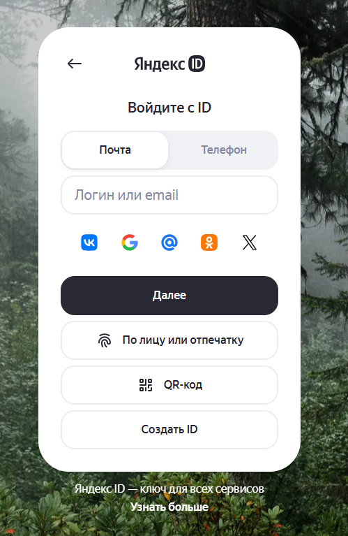
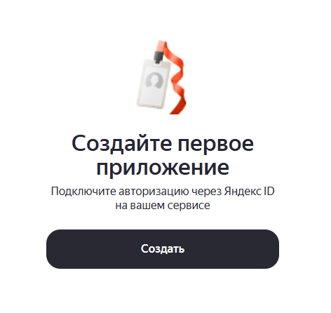
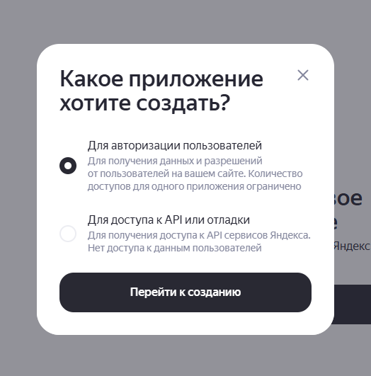
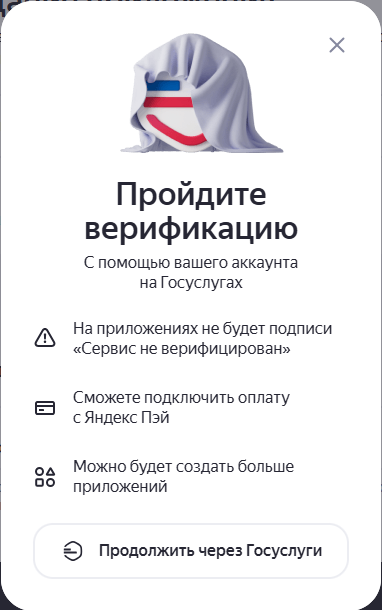
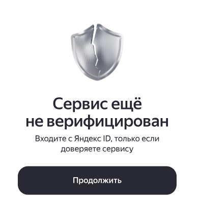
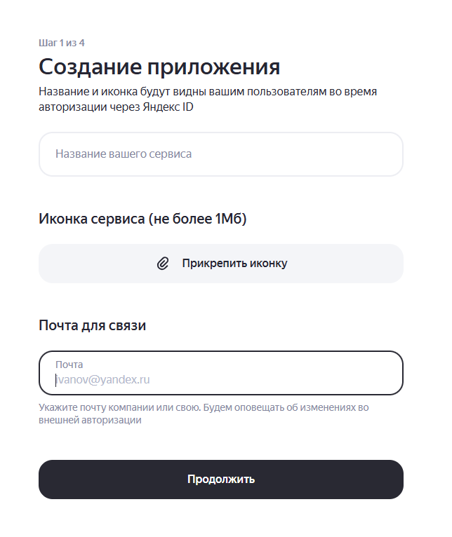
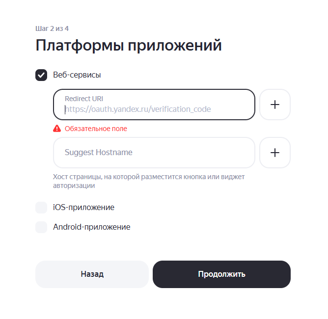
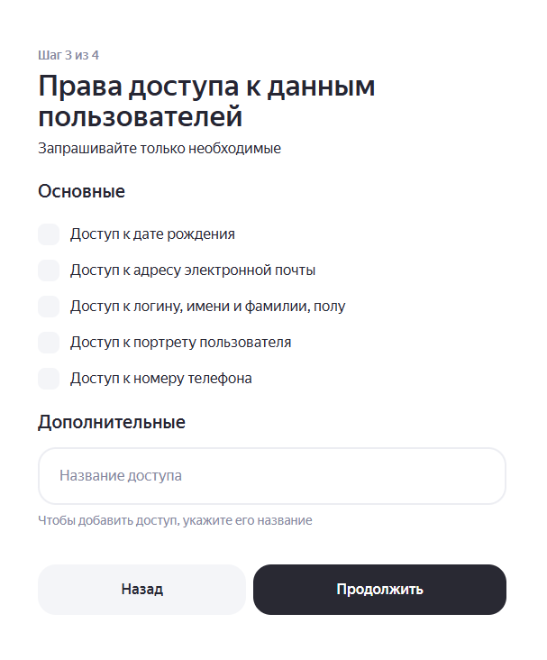
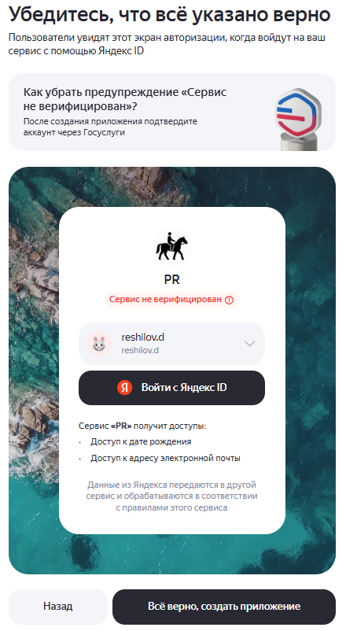

# Создание приложения для авторизации пользователей с помощью Яндекс ID

<aside class="sidebar">

<b>Содержание</b>

<a href="#step-1">Шаг 1. Кабинет Яндекс OAuth</a>
<a href="#step-2">Шаг 2. Создание приложения</a>
<a href="#step-3">Шаг 3. Верификация</a>
<a href="#step-4">Шаг 4. Сведения о приложении</a>
<a href="#step-5">Шаг 5. Redirect URI</a>
<a href="#step-6">Шаг 6. Доступ к данным</a>
<a href="#step-7">Шаг 7. Завершение регистрации</a>

</aside>

<main class="content">

<h2 id="step-1">Шаг 1. Перейти в кабинет Яндекс OAuth</h2>

Авторизуйтесь в сервисе [Яндекс OAuth](https://oauth.yandex.ru/) через аккаунт, с помощью которого планируете продолжать разработку.

<h4>Важно</h4>

Чтобы не потерять доступ к приложению, используйте аккаунт, к которому у вас всегда будет доступ.

---

<h2 id="step-2">Шаг 2. Создать приложение</h2>

1. Нажмите кнопку <b>Создать</b>. 
2. Во всплывающем окне выберите <b>Для авторизации пользователей</b> 
3. Нажмите <b>Перейти к созданию</b>.

  
  

---

<h2 id="step-3">Шаг 3. Пройти верификацию (опционально)</h2>

Далее будет предложено пройти верификацию аккаунта. Она даёт следующие преимущества:

1. Доступ к технической поддержке Яндекс OAuth.
2. Возможность регистрации более 5 приложений.
3. Доступ к дополнительной информации о пользователе.

Подробнее об этом процессе можно прочитать в [документации](https://yandex.ru/dev/id/doc/ru/confirm-account). Это окно можно закрыть и продолжить создание приложения, либо пройти верификацию сразу.

  
  

---

<h2 id="step-4">Шаг 4. Указать сведения о приложении</h2>

1. Укажите <b>название сервиса</b>.
2. Загрузите <b>иконку</b> размером до 1 МБ.
3. Заполните поле <b>Почта для связи</b>. Убедитесь, что адрес актуален, чтобы не пропустить важную информацию об изменениях в продукте.
4. Нажмите <b>Продолжить</b>.

---

<h2 id="step-5">Шаг 5. Настроить платформу и Redirect URI</h2>

1. В списке платформ выберите <b>Веб-сервисы</b>.
2. Укажите <b>Redirect URI</b>.
3. Если используете несколько окружений, например `dev`, `stage` и `prod`, добавьте для них отдельные Redirect URI.
4. Поле <b>Suggest Hostname</b> можно оставить пустым.
5. Нажмите <b>Продолжить</b>.

<h4>Примечание</h4>

`Redirect URI`, указанный в OAuth-приложении, может не полностью совпадать с URI в запросе, однако следующие части адреса должны совпадать:

Например, для адреса `https://example.ru:8443/oauth/callback?source=yandex#done`:

- схема: `https` — должна совпадать
- хост: `example.ru` — должен совпадать
- порт: `8443` — должен совпадать
- путь: `/oauth/callback` — должен совпадать
- запрос (`query`): `source=yandex` — может не совпадать
- фрагмент (`fragment`): `done` — может не совпадать

<h2 id="step-6">Шаг 6. Доступ к данным</h2>

1. Выберите данные пользователя, доступ к которым нужно получить.
2. Нажмите <b>Продолжить</b>.

<h4>Основные и дополнительные данные</h4>

<b>Основные</b> — это базовые данные профиля, которые обычно нужны для авторизации пользователя:

- дата рождения;
- адрес электронной почты;
- логин, имя, фамилия, пол;
- портрет пользователя;
- номер телефона.

<b>Дополнительные</b> — это расширенные права доступа к другим сервисам Яндекса, например к Диску, Директу и другим API.

Если вам нужна только авторизация пользователя, обычно достаточно основных данных. Запрашивайте только те права, которые действительно нужны вашему сервису.



<h2 id="step-7">Шаг 7. Завершение регистрации</h2>

После настройки всех параметров приложения в Яндекс OAuth отобразится окно, которое увидят пользователи, когда войдут в приложение с помощью Яндекс ID. Чтобы подтвердить сохранение, нажмите <b>Всё верно</b>.

</main>

